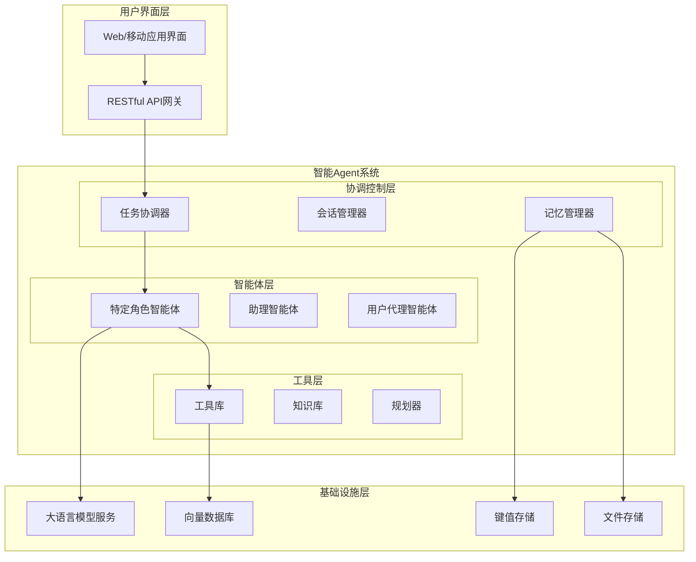

# 基于CAMEL框架的智能Agent应用开发架构与实施方案

## 1. 项目概述

本项目旨在利用开源的CAMEL（Communicative Agents for Mind Exploration of Large Language Models）框架，构建一个智能Agent应用。CAMEL框架专注于通过角色扮演和对话促进大语言模型的心智探索，适用于构建复杂的多智能体协作系统。

## 2. 架构设计

### 2.1 整体架构


### 2.2 核心组件详细设计

#### 2.2.1 智能体协调系统
```python
class TaskCoordinator:
    """任务协调器 - 负责分配任务和管理智能体协作"""
    def __init__(self):
        self.agents = {}  # 注册的智能体
        self.task_queue = []  # 任务队列
        self.sessions = {}  # 会话管理
    
    def register_agent(self, agent_id, agent_type, capabilities):
        """注册智能体"""
        self.agents[agent_id] = {
            'type': agent_type,
            'capabilities': capabilities,
            'status': 'idle'
        }
    
    def assign_task(self, task, requirements):
        """分配任务给合适的智能体"""
        suitable_agents = self._find_suitable_agents(requirements)
        if not suitable_agents:
            return self._create_new_agent(requirements)
        
        # 选择最合适的智能体
        selected_agent = self._select_best_agent(suitable_agents, task)
        return self._dispatch_task(selected_agent, task)
    
    def _find_suitable_agents(self, requirements):
        """根据需求查找合适的智能体"""
        return [agent_id for agent_id, info in self.agents.items() 
                if self._matches_requirements(info['capabilities'], requirements)]
```

#### 2.2.2 智能体基础类
```python
class BaseAgent:
    """智能体基类"""
    def __init__(self, agent_id, role, model_provider="openai"):
        self.agent_id = agent_id
        self.role = role
        self.memory = MemoryManager(agent_id)
        self.tools = ToolLibrary()
        self.model = ModelProviderFactory.get_provider(model_provider)
        
    def process_message(self, message, session_id):
        """处理传入消息"""
        # 1. 更新对话上下文
        self.memory.update_context(session_id, message)
        
        # 2. 规划下一步行动
        plan = self.plan_next_action(message, session_id)
        
        # 3. 执行行动
        response = self.execute_plan(plan, session_id)
        
        # 4. 更新记忆
        self.memory.store_interaction(session_id, message, response, plan)
        
        return response
    
    def plan_next_action(self, message, session_id):
        """规划下一步行动"""
        context = self.memory.get_context(session_id)
        tools = self.tools.get_available_tools()
        
        prompt = self._create_planning_prompt(message, context, tools)
        plan = self.model.generate(prompt, max_tokens=200)
        
        return self._parse_plan(plan)
    
    def execute_plan(self, plan, session_id):
        """执行行动计划"""
        if plan['action'] == 'use_tool':
            return self.tools.execute(plan['tool'], plan['parameters'])
        elif plan['action'] == 'respond':
            return self._generate_response(plan['content'])
        elif plan['action'] == 'delegate':
            return self.coordinator.assign_task(plan['task'], plan['requirements'])
```

## 3. 技术选型

### 3.1 核心框架
- **CAMEL框架**: 开源的多智能体对话框架
- **LangChain**: 用于构建LLM应用的工具链
- **LlamaIndex**: 用于数据索引和检索

### 3.2 模型服务
- **OpenAI GPT-4/GPT-3.5**: 作为主要语言模型
- **本地模型备选**: Vicuna, ChatGLM3, 或其它开源模型

### 3.3 数据存储
- **向量数据库**: ChromaDB 或 Pinecone (用于语义搜索)
- **传统数据库**: PostgreSQL (用于结构化数据)
- **缓存**: Redis (用于会话管理和临时数据)

### 3.4 部署与运维
- **容器化**: Docker + Docker Compose
- **编排**: Kubernetes (生产环境)
- **监控**: Prometheus + Grafana
- **日志**: ELK Stack

## 4. 实施计划

### 4.1 阶段一: 基础环境搭建 (1-2周)
1. 搭建开发环境
2. 安装和配置CAMEL框架
3. 设置模型API连接
4. 创建基础项目结构

### 4.2 阶段二: 核心功能开发 (3-4周)
1. 实现智能体基类和角色定义
2. 开发任务协调系统
3. 实现记忆管理模块
4. 集成工具调用功能

### 4.3 阶段三: 应用场景实现 (2-3周)
1. 设计特定领域对话流程
2. 开发领域专用工具
3. 实现多智能体协作逻辑
4. 构建用户界面

### 4.4 阶段四: 测试与优化 (1-2周)
1. 单元测试和集成测试
2. 性能测试和优化
3. 用户体验测试和改进
4. 安全审计

### 4.5 阶段五: 部署与监控 (1周)
1. 生产环境部署
2. 监控和告警设置
3. 文档编写
4. 培训和维护计划

## 5. 应用场景示例: 智能旅行规划助手

### 5.1 角色设计
```python
# 定义旅行规划相关的智能体角色
travel_roles = {
    "travel_planner": {
        "role": "资深旅行规划师",
        "goal": "为用户制定完美的旅行计划",
        "backstory": "你是一位有20年经验的旅行规划专家，擅长根据用户偏好制定个性化旅行方案"
    },
    "local_guide": {
        "role": "当地向导",
        "goal": "提供目的地详细信息和建议",
        "backstory": "你是目的地的本地居民，对当地文化、美食和景点了如指掌"
    },
    "budget_advisor": {
        "role": "预算顾问",
        "goal": "帮助用户优化旅行预算",
        "backstory": "你是财务规划专家，擅长在保证体验的前提下优化旅行开支"
    }
}
```

### 5.2 对话流程设计
```python
def travel_planning_conversation(user_request):
    """旅行规划对话流程"""
    # 1. 初始化会话和智能体
    session_id = str(uuid.uuid4())
    coordinator = TaskCoordinator()
    
    # 2. 注册相关智能体
    coordinator.register_agent("planner_1", "travel_planner", 
                              ["destination_recommendation", "itinerary_planning"])
    coordinator.register_agent("guide_1", "local_guide", 
                              ["local_knowledge", "attraction_recommendation"])
    coordinator.register_agent("budget_1", "budget_advisor", 
                              ["cost_estimation", "budget_optimization"])
    
    # 3. 分析用户请求并分配任务
    task_analysis = coordinator.analyze_request(user_request)
    
    # 4. 执行多智能体协作
    results = {}
    for task in task_analysis['tasks']:
        agent_id = coordinator.assign_task(task, task['requirements'])
        result = coordinator.execute_task(agent_id, task, session_id)
        results[task['type']] = result
    
    # 5. 整合结果并生成最终响应
    final_response = coordinator.synthesize_results(results, user_request)
    
    return final_response
```

### 5.3 工具集成示例
```python
class TravelTools:
    """旅行相关工具集"""
    
    @tool
    def search_flights(self, origin, destination, date, budget=None):
        """搜索航班信息"""
        # 集成航班API
        api_url = f"https://api.flightsearch.com/v1/search"
        params = {
            "origin": origin,
            "destination": destination,
            "date": date,
            "max_price": budget
        }
        
        response = requests.get(api_url, params=params)
        return response.json()
    
    @tool
    def find_accommodations(self, location, check_in, check_out, guests=1, budget=None):
        """查找住宿选项"""
        # 集成住宿API
        api_url = f"https://api.hotels.com/v1/search"
        params = {
            "location": location,
            "check_in": check_in,
            "check_out": check_out,
            "guests": guests,
            "max_price": budget
        }
        
        response = requests.get(api_url, params=params)
        return response.json()
    
    @tool
    def get_attractions(self, location, categories=None, budget=None):
        """获取旅游景点信息"""
        # 集成景点API或本地数据库
        conn = sqlite3.connect('attractions.db')
        cursor = conn.cursor()
        
        query = "SELECT * FROM attractions WHERE location = ?"
        params = [location]
        
        if categories:
            query += " AND category IN ({})".format(','.join(['?']*len(categories)))
            params.extend(categories)
        
        if budget:
            query += " AND price <= ?"
            params.append(budget)
        
        cursor.execute(query, params)
        results = cursor.fetchall()
        conn.close()
        
        return results
```

## 6. 评估与优化策略

### 6.1 性能评估指标
1. **响应时间**: 平均响应时间 < 3秒
2. **任务完成率**: > 90% 的用户请求得到满意解决
3. **用户满意度**: 通过反馈收集，目标 > 4.5/5
4. **错误率**: 对话错误率 < 5%

### 6.2 优化策略
1. **缓存策略**: 对常见查询结果进行缓存
2. **模型优化**: 使用更小的专用模型处理常见任务
3. **异步处理**: 对耗时操作采用异步处理
4. **负载均衡**: 在多GPU/多节点间分配模型推理负载

## 7. 风险管理

### 7.1 技术风险
1. **模型API稳定性**: 准备备用模型提供商
2. **框架兼容性**: 定期更新和测试依赖库
3. **性能瓶颈**: 实施监控和自动扩缩容

### 7.2 业务风险
1. **用户期望管理**: 明确应用能力和限制
2. **数据隐私**: 实施严格的数据保护措施
3. **内容安全**: 添加内容过滤和审核机制

## 8. 后续扩展计划

### 8.1 短期扩展 (3-6个月)
1. 增加更多专业领域的智能体
2. 集成更多外部API和服务
3. 开发移动端应用
4. 实现多语言支持

### 8.2 中长期扩展 (6-12个月)
1. 实现自主学习能力
2. 开发自定义模型训练管道
3. 构建智能体市场平台
4. 实现跨平台集成

## 9. 团队与资源规划

### 9.1 团队组成
1. **项目负责人**: 1名
2. **AI工程师**: 2-3名
3. **后端开发**: 1-2名
4. **前端开发**: 1名
5. ** DevOps工程师**: 1名

### 9.2 资源需求
1. **开发环境**: 高性能GPU服务器 (至少2×A100)
2. **测试环境**: 中等配置GPU服务器
3. **生产环境**: 云服务或自有服务器集群
4. **API预算**: 模型API调用费用

## 10. 结论

本方案提供了一个基于CAMEL框架构建智能Agent应用的完整架构和实施计划。通过角色扮演和多智能体协作的方式，可以创建出能够处理复杂任务的智能系统。旅行规划助手作为示例应用，展示了如何将理论转化为实际应用。

该架构具有良好的可扩展性，可以轻松适应其他领域和应用场景。通过分阶段实施和持续优化，可以逐步构建出强大而可靠的智能Agent系统。
