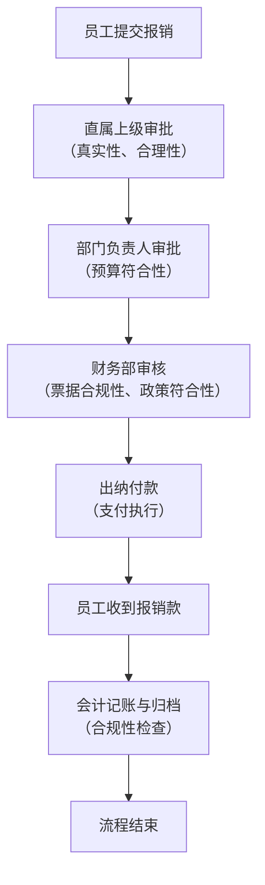

经典的企业管理问题。员工报销流程是公司内控和财务管理的重要组成部分，旨在确保费用的**真实性、合规性和合理性**。

下面我将为您详细拆解一个标准、完整的员工报销流程及其涉及的角色。

---

### 一、报销流程详解

典型的报销流程可以概括为以下**7个核心步骤**，如下图所示，它形成了一个完整的闭环：

下面我们来详细解释每个步骤的工作：

**1. 员工提交报销**
*   **动作**：员工在发生合规的业务费用（如差旅、餐饮、采购办公用品）后，收集并整理所有费用的**原始发票**和**凭证**（如小票、合同等）。然后，在公司指定的报销系统（如OA、ERP、费控软件等）中填写报销单，选择对应的费用类型，准确填写金额、时间、事由、客户项目等信息，并将发票等凭证以附件形式上传或线下粘贴提交。
*   **关键**：填写准确、附件齐全、事由清晰。

**2. 直属上级审批**
*   **动作**：员工的直接经理或团队主管收到审批通知。主管需要审核这笔费用发生的**业务真实性**和**合理性**。例如：“这笔招待费确实是为了某个项目客户发生的吗？”、“这个金额和标准是否合理？”
*   **关键**：确认费用与业务相关，且必要性合理。

**3. 部门负责人/预算负责人审批**
*   **动作**：对于超过一定金额的报销，或需要从部门预算中支出的费用，需要部门负责人（总监等）进行审批。审批重点在于**预算符合性**，即部门当前是否有足够的预算来覆盖这笔支出，以及这笔支出是否符合部门的业务规划。
*   **关键**：预算控制和规划符合性。

**4. 财务部审核**
*   **动作**：这是**合规性审查**最关键的一环。财务专员（通常是费用会计）会仔细审核：
    *   **票据真伪**：发票是否真实有效。
    *   **票据规范性**：发票抬头、税号是否正确，印章是否清晰，是否为国家税务总局监制的正规发票。
    *   **政策符合性**：费用是否符合公司的《费用报销政策》（例如：差旅住宿标准、餐饮人均标准等）。
    *   **数据准确性**：报销单金额与附件金额是否一致，计算是否正确。
    *   如果发现问题，财务会驳回并注明原因，退回给员工修改重新提交。
*   **关键**：确保票据合法、符合财税法规和公司内部政策。

**5. 出纳付款**
*   **动作**：审核通过后，报销单流转至出纳。出纳根据报销单上提供的员工银行账户信息，通过公司账户进行**支付操作**（通常是对公转账），并将报销款打入员工账户。现在很多系统支持自动付款。
*   **关键**：准确、及时地支付款项。

**6. 会计记账与归档**
*   **动作**：付款完成后，会计人员会根据报销单的财务信息（费用类别、税金等）进行**账务处理**，生成会计凭证，将费用计入正确的会计科目。最后，将所有纸质和电子凭证按规定期限进行**归档保存**，以备日后审计和查验。
*   **关键**：账务准确、凭证归档完整。

**7. 员工收到报销款**
*   **动作**：员工查询银行账户，确认报销款是否到账。如有问题，需及时与财务部出纳沟通。

---

### 二、涉及的角色及其职责

整个流程中，主要涉及以下**5个核心角色**：

1.  **员工（报销申请人）**
    *   **职责**：发生合规的业务费用，妥善保管并整理原始票据，如实填写并提交报销申请，对费用的真实性和业务相关性负首要责任。

2.  **审批人（通常为直属上级 & 部门负责人）**
    *   **职责**：逐级审核费用的**业务真实性**、**合理性**和**预算符合性**。他们是业务层面的把关者，确保钱花在了“正当的业务”上。

3.  **财务审核人（费用会计/财务专员）**
    *   **职责**：负责**合规性审核**，是政策和法规的守护者。确保票据合法、符合税法要求、符合公司内部财务政策，是控制财务风险的关键角色。

4.  **出纳**
    *   **职责**：负责最后的**支付执行**，确保准确、安全地将款项支付给员工。

5.  **系统管理员/IT支持**
    *   **职责**：（后台角色）维护和保障报销系统的稳定运行，管理流程节点和权限设置，解决员工在系统使用中遇到的技术问题。

**补充说明：**
*   在一些小微企业中，角色可能会合并，例如财务审核人和出纳可能由同一人担任，甚至部门审批和财务审核也由老板一人完成。
*   在大型集团中，角色可能分得更细，还会有**内部审计**角色，负责事后抽查，确保整个流程的合规性，形成监督机制。
