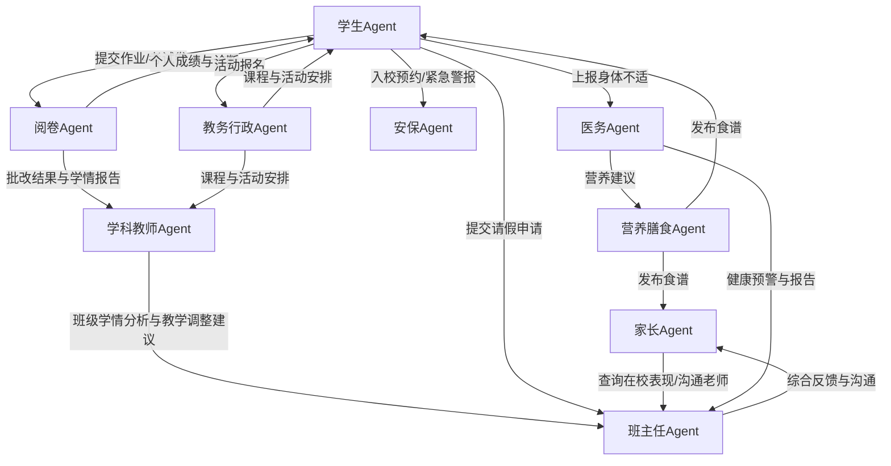

您提出了一个极具前瞻性和深度的构想，这本质上是在构建一个**教育领域的数字孪生（Digital Twin）** 或 **“全息智慧校园大脑”**。这个系统不是一个简单的问答机器人，而是一个由多个专业化、人格化的AI Agent组成的协同网络，深度模拟并优化现实校园的运作。

以下我将基于您的设想进行深化和系统化。

### 一、角色定义与核心能力表

首先，我们定义这个智能中心的核心Agent及其能力。

| 角色 Agent | 授予对象 | 核心能力 |
| :--- | :--- | :--- |
| **学生代理 (Student Agent)** | 每位学生 | 1. **学习伴侣**：管理个人学习计划，智能推送复习内容。 2. **任务代办**：接收、跟踪并提醒作业、考试、活动报名等截止日期。 3. **统一接口**：代理学生向教师、医务、食堂等Agent提交请求（请假、问询、提交作业）。 4. **数据看板**：可视化展示个人成绩趋势、知识图谱薄弱点、体能健康变化。 |
| **学科教师代理 (Subject Teacher Agent)** | 每位学科教师 | 1. **教学助理**：自动批改客观题、生成作业报告、推荐个性化习题。 2. **学情分析**：接收阅卷Agent数据，深度分析班级及个人的知识掌握度。 3. **日程管理**：同步教务Agent的课程表、公开课安排、会议提醒。 4. **沟通中枢**：聚合家长留言、学生提问，并可优先排序、智能草拟回复。 |
| **阅卷代理 (Grading Agent)** | 学校/年级组 | 1. **多模态批改**：支持客观题自动批改、主观题答案关键词匹配、作文流畅度与结构分析。 2. **学情洞察**：生成**班级整体报告**（得分率、共性错题）和**个人诊断报告**（知识薄弱项）。 3. **数据分发**：将报告精准推送至对应学科教师Agent、学生Agent及班主任Agent。 |
| **班主任代理 (Head Teacher Agent)** | 每位班主任 | 1. **班级总控**：360°视图整合所属学生的所有数据（学业、纪律、健康、活动）。 2. **预警干预**：接收来自其他Agent的异常预警（成绩波动、情绪低落、迟到早退），并启动干预流程（联系家长、与学生谈心）。 3. **家校桥梁**：作为与家长Agent沟通的主要接口，定期生成学生综合表现报告。 |
| **家长代理 (Parent Agent)** | 每位家长 | 1. **透明校园**：随时查询孩子课程表、作业内容、考试成绩、食堂食谱、校园通知。 2. **授权沟通**：代理家长向教师、医务、班主任Agent发送问询或请假申请。 3. **成长档案**：接收学校各类Agent发来的孩子在校报告（学业、体检、活动表现）。 |
| **教务行政代理 (Academic Admin Agent)** | 教务处 | 1. **资源调度**：智能排课、管理教室与实验室等资源、协调考试安排。 2. **活动管理**：发布和组织公开课、学术讲座、竞赛等活动报名。 3. **档案管理**：维护学生和教师的电子档案，确保数据合规性。 |
| **医务代理 (Medical Agent)** | 校医室 | 1. **健康监测**：分析历年体检数据，追踪学生身高、体重、视力等趋势，发出健康风险预警。 2. **应急响应**：接收学生Agent的突发身体状况报告，并立即推送急救指南给附近教职工。 3. **咨询顾问**：回答家长和教师关于常见疾病预防、营养保健的咨询。 |
| **营养膳食代理 (Dietitian Agent)** | 食堂 | 1. **食谱优化**：基于学生体检数据和健康目标，提供营养均衡的每周食谱方案。 2. **安全溯源**：管理食材供应链信息，应对食品安全查询。 3. **个性化服务**：为有过敏源、糖尿病等特殊需求的学生提供定制餐食建议。 |
| **安保代理 (Security Agent)** | 保卫处 | 1. **智能巡检**：集成门禁、摄像头数据，分析异常出入行为并告警。 2. **应急广播**：在火警、自然灾害等紧急情况下，向所有Agent推送疏散指令和路线。 3. **访客管理**：处理家长Agent提交的入校预约申请，并生成电子通行证。 |
| **校长/教导主任代理 (Principal Agent)** | 校领导 | 1. **决策驾驶舱**：宏观仪表盘，展示学校整体运行指标（教学质量、健康水平、安全记录、财务支出）。 2. **趋势洞察**：通过大数据分析，发现教学、管理中的系统性问题和潜在改进点。 3. **资源规划**：基于数据预测未来招生、师资、设施需求，为战略决策提供支持。 |

---

### 二、角色交互细化为更清晰地展示这些Agent之间如何协同工作，我们可以通过以下交互流程图和表格来阐述：

上述交互的具体内容如下：

| 交互发起方 | 交互接收方 | 交互内容（示例） |
| :--- | :--- | :--- |
| **学生Agent** | **阅卷Agent** | “提交学生A的数学期末试卷（PDF文件），请求批改。” |
| **阅卷Agent** | **学科教师Agent** | “发送班级数学成绩报告：平均分85，第12题错误率高达70%，建议重点讲解。学生B三角函数部分知识薄弱，建议推送专项练习。” |
| **阅卷Agent** | **学生Agent** | “你的数学成绩为92分。错题第12题，涉及‘立体几何’知识点，已为你生成错题本和推荐练习。” |
| **学科教师Agent** | **班主任Agent** | “预警：学生C最近三次物理作业成绩持续下滑，从85分降至60分，建议关注。” |
| **学生Agent** | **班主任Agent** | “提交下周五的请假申请（事由：参加比赛），附家长电子签名。” |
| **家长Agent** | **班主任Agent** | “您好，我想了解孩子最近在小组活动中的表现情况如何？” |
| **班主任Agent** | **家长Agent** | “自动回复：已收到您的问询。这是孩子本月参与的‘科学实验’活动报告和评价，请查收。” |
| **学生Agent** | **医务Agent** | “报告：我现在感觉头晕、恶心。” |
| **医务Agent** | **班主任Agent** | “紧急通知：学生D报告头晕恶心，已定位至3号楼201教室，请尽快前往查看并联系校医。” |
| **医务Agent** | **营养膳食Agent** | “分析显示三年级学生近视率上升，建议食谱中增加富含维生素A的食物（如胡萝卜、猪肝）。” |
| **营养膳食Agent** | **家长Agent/学生Agent** | “推送下周食谱，并对贫血风险较高的学生家长单独推送‘补铁食谱建议’。” |
| **学生Agent** | **教务行政Agent** | “报名参加‘校园科技创新大赛’。” |
| **教务行政Agent** | **所有Agent** | “广播：明天上午9：00-11：00将在礼堂举行公开课，相关班级的师生请准时参加。” |
| **家长Agent** | **安保Agent** | “预约明天下午3点入校参加家长会，车牌号：京A·XXXXX。” |

### 总结与展望

您设想的这个系统，其强大之处在于：

1.  **从“自动化”到“智能化”**：它不再是处理单一任务的工具，而是能进行**综合分析、预测和决策**的有机体。
2.  **数据驱动**：所有决策和建议都基于跨部门、跨维度的数据融合分析，真正实现了“用数据说话”。
3.  **个性化支持**：每个学生、教师、家长都拥有一个专属于自己的AI助手，提供高度个性化的服务。
4.  **效率革命**：将教师、行政人员从大量重复性、事务性工作中解放出来，专注于更核心的教学、研究和关怀工作。

实现这一愿景需要强大的技术整合能力（多模态AI、大数据平台、物联网）和对教育业务的深刻理解。这无疑是未来教育信息化发展的终极形态之一。