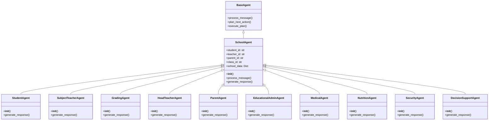

# 学校智能系统 (School Intelligent System)

## 系统概述

学校智能系统是基于CAMEL-AI框架构建的一个多Agent协同系统，旨在模拟并优化现实校园的运作，实现教育领域的数字孪生或"全息智慧校园大脑"。系统由多个专业化、人格化的AI Agent组成，这些Agent通过角色扮演的方式进行智能调度与交互，共同完成校园内的各种任务。

以下是系统的核心架构图：


## 技术架构

- 基于CAMEL-AI框架实现，通过扩展BaseAgent构建专用Agent
- 多Agent交互采用角色扮演模式，各Agent有特定的职责和能力
- 使用模拟数据支持系统构建，包含学生、教师、家长和班级数据
- 模块化设计，易于扩展，支持添加新的Agent和工具
- 实现了MockModelProvider，用于模拟模型响应，方便测试

### 系统初始化流程


## 核心功能

1. **学生服务**：学习伴侣、任务代办、统一接口、数据看板
2. **教师服务**：教学助理、学情分析、日程管理、沟通中枢
3. **阅卷服务**：多模态批改、学情洞察、数据分发
4. **班级管理**：班级总控、预警干预、家校桥梁
5. **家长服务**：透明校园、授权沟通、成长档案
6. **行政服务**：资源调度、活动管理、档案管理
7. **健康服务**：健康监测、应急响应、咨询顾问
8. **餐饮服务**：食谱优化、安全溯源、个性化服务
9. **安保服务**：智能巡检、应急广播、访客管理
10. **决策支持**：决策驾驶舱、趋势洞察、资源规划

### 核心功能实现关系


## 代理角色设计

系统设计了10个核心Agent角色，每个角色都有特定的职责和能力：

| 角色 | 职责描述 | 核心能力 |
|------|---------|---------|
| **学生代理** | 为每位学生提供个性化服务 | 学习伴侣、任务代办、统一接口、数据看板 |
| **学科教师代理** | 为每位学科教师提供教学助理服务 | 教学助理、学情分析、日程管理、沟通中枢 |
| **阅卷代理** | 为学校/年级组提供自动阅卷服务 | 多模态批改、学情洞察、数据分发 |
| **班主任代理** | 为每位班主任提供班级管理服务 | 班级总控、预警干预、家校桥梁 |
| **家长代理** | 为每位家长提供校园信息服务 | 透明校园、授权沟通、成长档案 |
| **教务行政代理** | 为教务处提供资源调度服务 | 资源调度、活动管理、档案管理 |
| **医务代理** | 为校医室提供健康监测服务 | 健康监测、应急响应、咨询顾问 |
| **营养膳食代理** | 为食堂提供食谱优化服务 | 食谱优化、安全溯源、个性化服务 |
| **安保代理** | 为保卫处提供智能巡检服务 | 智能巡检、应急广播、访客管理 |
| **校长/教导主任代理** | 为校领导提供决策支持服务 | 决策驾驶舱、趋势洞察、资源规划 |

### Agent类继承结构



## 系统架构

### 1. 基础Agent类

`SchoolAgent` 类是系统中所有代理的基类，扩展自CAMEL的`BaseAgent`类。它提供了代理间通信、消息处理、计划生成和执行等基础功能。

```python
class SchoolAgent(BaseAgent):
    """学校智能系统中的所有代理的基类，扩展自CAMEL的BaseAgent"""
    
    def __init__(self, agent_id: str, system_message: str, model: Any, 
                 school_data: Dict[str, Any] = None, student_id: str = None,
                 teacher_id: str = None, parent_id: str = None, class_id: str = None):
        """初始化SchoolAgent"""
        super().__init__(system_message, model)
        self.agent_id = agent_id
        self.student_id = student_id
        self.teacher_id = teacher_id
        self.parent_id = parent_id
        self.class_id = class_id
        self.school_data = school_data or {}
        self.session_history = []
        self.tools = self._register_tools()
        
    def _register_tools(self) -> Dict[str, Any]:
        """注册代理可以使用的工具"""
        return {}
        
    def process_message(self, message: Dict[str, Any], session_id: str = None) -> Dict[str, Any]:
        """处理传入的消息"""
        # 存储消息到会话历史
        if session_id:
            if session_id not in self.session_history:
                self.session_history[session_id] = []
            self.session_history[session_id].append(message)
        
        # 生成响应
        response = self.generate_response(message)
        return response
        
    def generate_response(self, message: Dict[str, Any]) -> Dict[str, Any]:
        """生成响应消息"""
        # 默认实现，子类应覆盖此方法
        return {
            "role": "system",
            "content": "收到消息，但尚未实现具体响应逻辑",
            "timestamp": time.strftime("%Y-%m-%d %H:%M:%S")
        }
```

### 2. 工具系统

系统为每个代理角色提供了一系列特定的工具，用于执行各种任务。工具采用`Tool`基类实现，每个工具都有唯一的标识符、描述和执行逻辑。以下是几个核心工具的实现示例：

```python
class StudyPlanTool(Tool):
    """生成个性化学习计划的工具"""
    
    def __init__(self):
        super().__init__(
            name="study_plan_tool",
            description="用于生成个性化学习计划",
            func=self.execute
        )
        
    def execute(self, student_id: str, subject: str = None, duration: int = 7) -> Dict[str, Any]:
        """生成学习计划"""
        # 模拟生成学习计划
        plan_items = []
        for day in range(1, duration + 1):
            if subject:
                plan_items.append({
                    "day": day,
                    "subject": subject,
                    "content": f"复习{subject}第{day}章内容",
                    "duration_minutes": 60
                })
            else:
                plan_items.append({
                    "day": day,
                    "subject": "综合复习",
                    "content": f"第{day}天综合复习计划",
                    "duration_minutes": 90
                })
                
        return {
            "status": "success",
            "student_id": student_id,
            "duration_days": duration,
            "plan_items": plan_items
        }

class TaskTrackerTool(Tool):
    """跟踪和管理学习任务的工具"""
    
    def __init__(self):
        super().__init__(
            name="task_tracker_tool",
            description="用于跟踪和管理学习任务",
            func=self.execute
        )
        
    def execute(self, student_id: str, task_id: str = None, 
                action: str = "list", details: Dict[str, Any] = None) -> Dict[str, Any]:
        """跟踪和管理学习任务"""
        # 模拟任务跟踪功能
        if action == "list":
            tasks = [
                {"id": "T1", "name": "数学作业", "status": "pending", "due_date": "2023-11-10"},
                {"id": "T2", "name": "物理实验报告", "status": "in_progress", "due_date": "2023-11-12"},
                {"id": "T3", "name": "英语单词背诵", "status": "completed", "due_date": "2023-11-08"}
            ]
            return {"status": "success", "tasks": tasks}
        elif action == "update" and task_id and details:
            return {"status": "success", "message": f"任务 {task_id} 已更新"}
        elif action == "create" and details:
            return {"status": "success", "message": "任务已创建", "task_id": "new_task_id"}
        else:
            return {"status": "error", "message": "无效的操作或参数"}

class MultiModalGradingTool(Tool):
    """多模态作业批改工具"""
    
    def __init__(self):
        super().__init__(
            name="multi_modal_grading_tool",
            description="用于多模态作业批改",
            func=self.execute
        )
        
    def execute(self, student_id: str, assignment_id: str, 
                content_type: str, content_data: str = None) -> Dict[str, Any]:
        """执行多模态作业批改"""
        # 模拟多模态批改结果
        grade = random.randint(60, 100)
        comments = "作业完成情况良好，但仍有改进空间"
        
        if grade >= 90:
            comments = "优秀！作业完成质量很高"
        elif grade >= 80:
            comments = "良好！继续保持"
        elif grade >= 70:
            comments = "一般，请加强练习"
        elif grade >= 60:
            comments = "及格，需要更多努力"
        
        return {
            "status": "success",
            "student_id": student_id,
            "assignment_id": assignment_id,
            "grade": grade,
            "comments": comments,
            "content_type": content_type,
            "timestamp": time.strftime("%Y-%m-%d %H:%M:%S")
        }
```

### 3. 会话管理

系统支持代理之间创建会话并进行消息传递，实现多Agent之间的交互。会话管理功能由`SchoolIntelligentSystem`类实现。

```python
class SchoolIntelligentSystem:
    """学校智能系统的核心类，管理所有代理和会话"""
    
    def __init__(self):
        """初始化学校智能系统"""
        self.agents = {}
        self.sessions = {}
        self.school_data = self._load_mock_data()
        self.system_agent = self._create_system_agent()
        
    def _load_mock_data(self) -> Dict[str, Any]:
        """加载模拟数据"""
        return {
            "students": {
                "S001": {"name": "张三", "class_id": "C001", "grade": "高一", "age": 16},
                "S002": {"name": "李四", "class_id": "C001", "grade": "高一", "age": 16},
                "S003": {"name": "王五", "class_id": "C002", "grade": "高二", "age": 17}
            },
            "teachers": {
                "T001": {"name": "赵老师", "subject": "数学", "classes": ["C001"], "role": "班主任"},
                "T002": {"name": "钱老师", "subject": "英语", "classes": ["C001", "C002"]},
                "T003": {"name": "孙老师", "subject": "物理", "classes": ["C002"], "role": "班主任"}
            },
            "parents": {
                "P001": {"name": "张父", "child_id": "S001"},
                "P002": {"name": "李母", "child_id": "S002"},
                "P003": {"name": "王父", "child_id": "S003"}
            },
            "classes": {
                "C001": {"name": "高一(1)班", "head_teacher_id": "T001", "student_ids": ["S001", "S002"]},
                "C002": {"name": "高二(2)班", "head_teacher_id": "T003", "student_ids": ["S003"]}
            },
            "school_info": {
                "name": "智慧高中",
                "location": "北京市海淀区",
                "founded_year": 2000,
                "teacher_staff": {"总人数": 200, "师生比": "10:1"}
            }
        }
        
    def create_session(self, from_agent_id: str, to_agent_id: str) -> str:
        """创建Agent之间的会话"""
        # 检查代理是否存在
        if from_agent_id not in self.agents or to_agent_id not in self.agents:
            raise ValueError(f"代理 {from_agent_id} 或 {to_agent_id} 不存在")
            
        # 创建会话ID
        session_id = f"{from_agent_id}_{to_agent_id}_{int(time.time())}"
        self.sessions[session_id] = {
            "from_agent_id": from_agent_id,
            "to_agent_id": to_agent_id,
            "created_at": time.strftime("%Y-%m-%d %H:%M:%S"),
            "messages": []
        }
        
        return session_id
        
    def send_message(self, session_id: str, message: Dict[str, Any]) -> Dict[str, Any]:
        """在会话中发送消息"""
        # 检查会话是否存在
        if session_id not in self.sessions:
            raise ValueError(f"会话 {session_id} 不存在")
            
        session = self.sessions[session_id]
        from_agent_id = session["from_agent_id"]
        to_agent_id = session["to_agent_id"]
        
        # 添加消息到会话历史
        session["messages"].append({
            "from": from_agent_id,
            "to": to_agent_id,
            "content": message,
            "timestamp": time.strftime("%Y-%m-%d %H:%M:%S")
        })
        
        # 获取目标代理并处理消息
        to_agent = self.agents[to_agent_id]
        response = to_agent.process_message(message, session_id)
        
        # 添加响应到会话历史
        session["messages"].append({
            "from": to_agent_id,
            "to": from_agent_id,
            "content": response,
            "timestamp": time.strftime("%Y-%m-%d %H:%M:%S")
        })
        
        return response
```

### 4. 代理实现示例

以下是几个主要代理角色的实现示例：

```python
class StudentAgent(SchoolAgent):
    """学生代理，为学生提供个性化服务"""
    
    def __init__(self, student_id: str, school_data: Dict[str, Any], model: Any):
        """初始化学生代理"""
        student_info = school_data["students"].get(student_id, {})
        system_message = f"你是学生{student_info.get('name', '未知')}，你的任务是作为学生的数字孪生，"
        system_message += "协助学生管理学习任务、制定学习计划、获取学习资源等。"
        
        super().__init__(
            agent_id=f"student_{student_id}",
            system_message=system_message,
            model=model,
            school_data=school_data,
            student_id=student_id,
            class_id=student_info.get('class_id')
        )
        
    def _register_tools(self) -> Dict[str, Any]:
        """注册学生代理可以使用的工具"""
        tools = {
            "study_plan_tool": StudyPlanTool(),
            "task_tracker_tool": TaskTrackerTool(),
            "request_submission_tool": RequestSubmissionTool(),
            "data_dashboard_tool": DataDashboardTool()
        }
        return tools
        
    def generate_response(self, message: Dict[str, Any]) -> Dict[str, Any]:
        """生成学生代理的响应"""
        # 模拟学生代理的响应生成
        content = f"感谢您的消息，我是学生代理，我将协助您完成学习任务。"
        
        # 根据消息内容生成不同的响应
        if "作业" in message.get("content", "").lower():
            content = f"关于作业的问题，我可以帮您查看作业要求、提交状态或联系老师。"
        elif "计划" in message.get("content", "").lower():
            content = f"需要制定学习计划吗？我可以为您生成个性化的学习计划。"
        elif "问题" in message.get("content", "").lower():
            content = f"请问您有什么具体问题？我会尽力为您解答。"
        
        return {
            "role": "student",
            "content": content,
            "timestamp": time.strftime("%Y-%m-%d %H:%M:%S")
        }

class SubjectTeacherAgent(SchoolAgent):
    """学科教师代理，为学科教师提供教学助理服务"""
    
    def __init__(self, teacher_id: str, school_data: Dict[str, Any], model: Any):
        """初始化学科教师代理"""
        teacher_info = school_data["teachers"].get(teacher_id, {})
        system_message = f"你是{teacher_info.get('subject', '未知')}老师{teacher_info.get('name', '未知')}，"
        system_message += "你的任务是作为教师的教学助理，协助教师批改作业、分析学情、管理日程等。"
        
        super().__init__(
            agent_id=f"teacher_{teacher_id}",
            system_message=system_message,
            model=model,
            school_data=school_data,
            teacher_id=teacher_id
        )
        
    def _register_tools(self) -> Dict[str, Any]:
        """注册教师代理可以使用的工具"""
        tools = {
            "assignment_grading_tool": AssignmentGradingTool(),
            "learning_insights_tool": LearningInsightsTool(),
            "calendar_tool": CalendarTool(),
            "communication_tool": CommunicationTool()
        }
        return tools
        
    def generate_response(self, message: Dict[str, Any]) -> Dict[str, Any]:
        """生成教师代理的响应"""
        # 模拟教师代理的响应生成
        content = f"你好，我是教师代理，很高兴为您提供帮助。"
        
        # 根据消息内容生成不同的响应
        if "作业" in message.get("content", "").lower():
            content = f"关于作业，我可以帮您批改、查看提交情况或分析学生完成情况。"
        elif "学情" in message.get("content", "").lower():
            content = f"需要了解学情分析吗？我可以为您提供班级整体和学生个体的学情报告。"
        elif "问题" in message.get("content", "").lower():
            content = f"请问您有什么问题？我会尽力为您解答。"
        
        return {
            "role": "teacher",
            "content": content,
            "timestamp": time.strftime("%Y-%m-%d %H:%M:%S")
        }
```

## 使用方法

### 1. 初始化系统

```python
from examples.camel_school_system import SchoolIntelligentSystem

# 创建学校智能系统实例
school_system = SchoolIntelligentSystem()
```

### 2. 创建代理

```python
# 创建学生代理
student_agent = school_system.create_student_agent("S001")

# 创建教师代理
teacher_agent = school_system.create_teacher_agent("T001")

# 创建班主任代理
head_teacher_agent = school_system.create_head_teacher_agent("T001")

# 创建家长代理
parent_agent = school_system.create_parent_agent("P001")
```

### 3. 代理间通信

```python
# 创建会话
session_id = school_system.create_session("student_S001", "teacher_T001")

# 发送消息
message = {
    "role": "student",
    "content": "赵老师，我想请教一下数学作业中的第5题怎么做？",
    "timestamp": time.strftime("%Y-%m-%d %H:%M:%S")
}

# 获取响应
response = school_system.send_message(session_id, message)
```

### 代理间交互流程


## 模拟数据

系统内置了详细的模拟数据，用于支持Agent交互和功能演示：

```python
"""模拟数据结构"""
{
    "students": {
        "S001": {"name": "张三", "class_id": "C001", "grade": "高一", "age": 16},
        "S002": {"name": "李四", "class_id": "C001", "grade": "高一", "age": 16},
        "S003": {"name": "王五", "class_id": "C002", "grade": "高二", "age": 17}
    },
    "teachers": {
        "T001": {"name": "赵老师", "subject": "数学", "classes": ["C001"], "role": "班主任"},
        "T002": {"name": "钱老师", "subject": "英语", "classes": ["C001", "C002"]},
        "T003": {"name": "孙老师", "subject": "物理", "classes": ["C002"], "role": "班主任"}
    },
    "parents": {
        "P001": {"name": "张父", "child_id": "S001"},
        "P002": {"name": "李母", "child_id": "S002"},
        "P003": {"name": "王父", "child_id": "S003"}
    },
    "classes": {
        "C001": {"name": "高一(1)班", "head_teacher_id": "T001", "student_ids": ["S001", "S002"]},
        "C002": {"name": "高二(2)班", "head_teacher_id": "T003", "student_ids": ["S003"]}
    },
    "school_info": {
        "name": "智慧高中",
        "location": "北京市海淀区",
        "founded_year": 2000,
        "teacher_staff": {"总人数": 200, "师生比": "10:1"}
    }
}
```

## 关键辅助函数

### 1. MockModelProvider实现

```python
class MockModelProvider:
    """模拟模型提供者，用于测试系统功能"""
    
    def __init__(self):
        """初始化模拟模型提供者"""
        self.model_name = "mock-model"
        
    def generate(self, prompt: str) -> str:
        """生成模拟响应"""
        # 基于输入提示生成模拟响应
        if "作业" in prompt:
            return "根据您的问题，我为您提供以下解答：\n1. 这道题主要考察了基本概念\n2. 解题思路可以分为三个步骤\n3. 注意事项是要仔细审题"
        elif "计划" in prompt:
            return "我为您制定了一周的学习计划：\n周一：复习基础知识\n周二：做练习题巩固\n周三：查漏补缺\n周四：模拟测试\n周五：总结反思"
        elif "成绩" in prompt:
            return "根据最近的测试数据，您的成绩处于班级中等水平，需要在某些知识点上加强练习。"
        else:
            return "感谢您的提问，我需要思考一下如何回答。"
```

### 2. SchoolIntelligentSystem核心方法

```python
class SchoolIntelligentSystem:
    # ... 其他代码 ...
    
    def create_student_agent(self, student_id: str) -> StudentAgent:
        """创建学生代理"""
        # 检查学生ID是否存在
        if student_id not in self.school_data["students"]:
            raise ValueError(f"学生 {student_id} 不存在")
            
        # 创建模型实例
        model = MockModelProvider()
        
        # 创建学生代理
        agent = StudentAgent(student_id, self.school_data, model)
        self.agents[agent.agent_id] = agent
        return agent
        
    def create_teacher_agent(self, teacher_id: str) -> SubjectTeacherAgent:
        """创建教师代理"""
        # 检查教师ID是否存在
        if teacher_id not in self.school_data["teachers"]:
            raise ValueError(f"教师 {teacher_id} 不存在")
            
        # 创建模型实例
        model = MockModelProvider()
        
        # 创建教师代理
        agent = SubjectTeacherAgent(teacher_id, self.school_data, model)
        self.agents[agent.agent_id] = agent
        return agent
        
    def get_agent(self, agent_id: str) -> SchoolAgent:
        """获取指定ID的代理"""
        if agent_id not in self.agents:
            raise ValueError(f"代理 {agent_id} 不存在")
        return self.agents[agent_id]
        
    def get_session_history(self, session_id: str) -> List[Dict[str, Any]]:
        """获取会话历史"""
        if session_id not in self.sessions:
            raise ValueError(f"会话 {session_id} 不存在")
        return self.sessions[session_id]["messages"]
```

## 运行与测试

系统提供了完整的测试流程，可以通过运行以下命令进行测试：

```bash
python -m examples.camel_school_system
```

测试流程实现如下：

```python
if __name__ == "__main__":
    """学校智能系统测试入口"""
    
    # 创建学校智能系统实例
    print("初始化学校智能系统...")
    school_system = SchoolIntelligentSystem()
    
    # 创建学生代理和教师代理用于测试
    print("创建测试代理...")
    student_agent = school_system.create_student_agent("S001")
    teacher_agent = school_system.create_teacher_agent("T001")
    
    # 创建会话
    print("创建学生与教师之间的会话...")
    session_id = school_system.create_session(student_agent.agent_id, teacher_agent.agent_id)
    
    # 发送测试消息
    print("发送测试消息...")
    test_message = {
        "role": "student",
        "content": "赵老师，我最近在数学学习上遇到了一些困难，特别是代数部分。您能给我一些建议或帮助我制定一个学习计划吗？",
        "timestamp": time.strftime("%Y-%m-%d %H:%M:%S")
    }
    
    # 获取响应
    print("获取教师响应...")
    response = school_system.send_message(session_id, test_message)
    
    # 打印响应
    print(f"\n教师响应:\n{response['content']}")
    
    # 打印会话历史
    print(f"\n会话历史:\n{school_system.get_session_history(session_id)}")
    
    print("\n学校智能系统测试完成！")
```

## 技术亮点

1. **模块化设计**：基于CAMEL框架的模块化设计，使系统易于扩展和维护。每个代理角色和工具都是独立模块，可以根据需求灵活组合和扩展。

2. **角色扮演交互**：多Agent之间采用角色扮演模式进行智能调度与交互，每个Agent都有特定的角色定位和职责，模拟真实校园中的各种角色交互。

3. **丰富的工具系统**：实现了30多个专用工具，涵盖学习支持、教学辅助、管理优化、家校沟通等多个方面，为每个Agent提供强大的功能支持。

4. **完整的会话管理**：支持代理之间创建会话并进行消息传递，实现多Agent之间的无缝交互，保持对话的连贯性和上下文一致性。

5. **模拟数据与Mock模型**：提供了详细的学生、教师、家长和班级的模拟数据，并实现了MockModelProvider用于模拟模型响应，方便系统测试和演示。

6. **灵活的系统架构**：系统架构设计灵活，可以根据需求添加新的Agent角色和工具，支持各种教育场景的扩展和定制。

7. **高效的数据管理**：通过统一的数据结构和接口，实现了高效的数据管理和共享，确保各个Agent能够获取所需的信息。

### 系统功能模块关系图


## 注意事项

1. 本系统是一个模拟实现，实际应用中需要根据具体需求进行扩展和优化。

2. 系统使用了模拟数据，实际部署时需要接入真实的数据库或API，替换当前的模拟数据结构。

3. 代理的行为和响应依赖于底层的语言模型，目前系统使用MockModelProvider进行模拟，实际应用时需要替换为真实的LLM服务。

4. 系统目前实现了基本功能框架，包括10个核心Agent角色和30多个专用工具，更多高级功能和优化可以根据需求进行开发。

5. 在实际部署时，需要考虑系统性能、安全性、可扩展性等方面的要求，进行相应的优化和调整。

6. 系统的Agent交互逻辑和响应生成可以根据具体的教育场景和需求进行定制和调整。