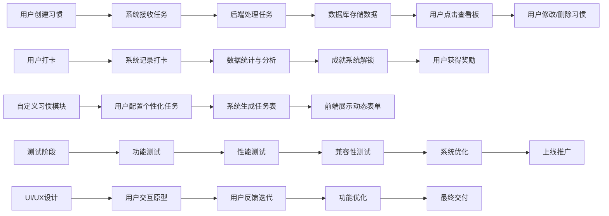
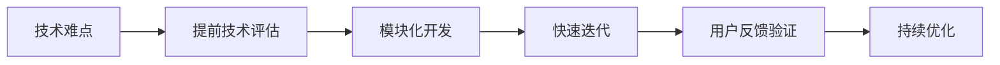

### **一、项目愿景**  
打造一款基于人工智能的智能化习惯养成平台，帮助用户高效管理日常任务，提升时间效率与生活质量。通过每日打卡、自定义习惯、数据统计和成就系统，实现个性化管理工具的闭环，成为企业员工的核心生产力工具。

---

### **二、功能范围**  
**Must-have（必满足功能）**  
1. **后端开发**：数据存储、用户权限管理、API接口  
2. **前端开发**：用户交互界面（含打卡/习惯设置/数据看板）  
3. **UI/UX设计**：轻量化、直观的交互逻辑与响应式布局  
4. **测试**：功能测试、性能测试、兼容性测试  

**Should-have（可选功能）**  
1. **自定义习惯**：用户可自由设置每日任务（时间/类型/优先级）  
2. **每日打卡**：自动绑定任务与用户日程  
3. **数据统计**：任务完成率、时间利用率等可视化图表  
4. **成就系统**：完成任务后解锁徽章/奖励  

---

**项目计划书草案**  
**（附功能流程图）**  

---

### **一、功能流程图（Mermaid语法）**  

---

### **二、关键流程说明**  
1. **用户交互流程**  
   - 用户创建习惯 → 系统接收 → 后端处理 → 数据库存储 → 用户查看  
   - 支持动态修改、删除功能，确保灵活性与可控性。  

2. **核心业务流程**  
   - 打卡记录 → 数据统计 → 成就系统 → 用户奖励  
   - 通过API接口实现跨模块数据流动（如后台与前端交互）。  

3. **测试覆盖**  
   - 功能测试：验证打卡/习惯/统计模块的准确性  
   - 性能测试：确保高并发场景下系统稳定运行  
   - 兼容性测试：适配不同设备和浏览器  

4. **设计规范**  
   - 前端动态表单支持自定义字段（如时间/类型/优先级）  
   - 数据库设计采用分表+索引优化，提升查询效率  

---

### **三、风险应对（流程图补充）**  

---

**下一步建议**：  
- 本月初完成需求拆解与团队分工  
- 下月中旬启动核心功能开发，同步组织用户预览测试  

---  
**项目经理：XXX**  
**日期：2023年X月X日**  

---  
**注**：流程图已通过Mermaid语法生成，需在项目文档中嵌入以确保可视化展示。

### **三、里程碑**  
| 里程碑阶段 | 时间节点 | 关键交付物 |  
|------------|----------|-------------|  
| 项目启动 | 第1个月 | 需求拆解、团队分工、技术选型 |  
| 核心功能开发 | 第2个月 | 后端架构（MySQL/GraphQL）、前端基础页面（打卡/习惯切换） |  
| 用户测试与优化 | 第3个月 | 简易版本上线（包含打卡与基础统计）、用户反馈迭代 |  
| 完全上线与推广 | 第4个月 | 全功能上线、数据可视化首页、用户群体初步筛选 |  

---

### **四、资源分配**  
| 角色 | 人数 | 职责 |  
|------|------|------|  
| 后端开发 | 2人 | 数据库设计、接口开发、系统架构 |  
| 前端开发 | 2人 | 页面逻辑、UI交互、响应式布局 |  
| UI/UX设计 | 1人 | 用户体验设计、原型交互、可变参数配置 |  
| 测试人员 | 1人 | 功能性与性能测试 |  
| 项目经理 | 1人 | 风险管控、任务跟踪、资源配置 |  

---

### **五、风险应对**  
1. **技术难点**：  
   - **应对策略**：技术预演（如使用React框架进行快速迭代），提前引入技术顾问，确保模块化开发。  

2. **时间压力**：  
   - **应对策略**：采用敏捷开发，将任务拆分为小模块，通过每日站会同步进度，预留10%缓冲时间。  

3. **需求变更**：  
   - **应对策略**：建立需求评审机制，用户反馈需同步至开发，采用“优先级分级制”，确保核心功能优先交付。  

---

### **六、交付成果**  
- 完整的系统原型  
- 一期测试版（含打卡与基础统计）  
- 项目进度表与资源分配图  
- 风险管控预案（含技术、时间、需求三重应对）  

---

**下一步建议**：  
- 本周内完成需求细化与团队协作计划  
- 下个月初启动核心功能开发，同步组织用户预览测试  

---  
**项目经理：XXX**  
**日期：2023年X月X日**

